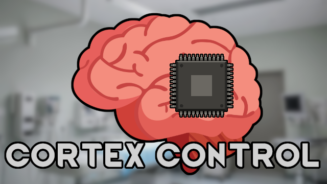

# Cortex Control

A mod for RimWorld to allow for forced recruitment of hostile pawns.

## Description
This mod has a slight dependency on Anomaly for reducing skill levels, but should still work fine outside a slight change in balance.

Transform your RimWorld experience with **Cortex Control**! This unique addition introduces a new surgery and three powerful implants designed to brainwash hostile pawns into adopting your ideology and joining your faction, regardless of their previous loyalty.

### 🛠️ Implants Overview

| Implant Name              | Description                                                                                   | Key Features                                                                                                                                                                                                                                       | Crafting Requirements                                                                |
|---------------------------|-----------------------------------------------------------------------------------------------|----------------------------------------------------------------------------------------------------------------------------------------------------------------------------------------------------------------------------------------------------|--------------------------------------------------------------------------------------|
| **Cognitive Rewiring Surgery** | A primitive method of mental domination, rewires the brain to make them easier to manipulate. | - High chance of death - Prevents inspirations - Multiplies consciousness by 0.8 - Increases mental break threshold by 15% - Removes unwavering loyalty - Certainty loss multiplier of 500%   - Reduces skill levels drastically | Requires Basic Control research (700 points)                                         |
| **Standard Control Chip**  | An advanced chip that automatically converts and recruits subjects.                           | - Prevents inspirations - Multiplies consciousness by 0.9 - Certainty loss set to 0% - Learning speed multiplier of 0.65   - Reduces skill levels by 1                                                                                 | Requires Standard Control research (1200 points),  4 basic components, 15 steel      |
| **Guidance Chip**         | A sophisticated chip that allows for passive regulation and free will.                        | - Prevents inspirations - Global learning factor of 0.95 - Certainty loss factor of 0.25 - Reduced social fight chance                                                                                                                    | Requires Advanced Control research (2200 points), 4 advanced components, 15 plasteel |
| **Null Chip**             | A brutal chip that nullifies emotions and needs, creating perfect soldiers.                   | - Immune to pain and emotions  - Disables social, artistic, animals, and intellectual work  - Cannot learn new skills, will not forget skills                                                                                                | Requires Advanced Control research (2200 points), 8 advanced components, 15 plasteel |

### 🧬 Implant Details

#### **Cognitive Rewiring Surgery**
This surgery rewires critical brain areas to enforce loyalty, often used by the ruling class in corporate-run urbworlds. While it offers a cheap solution for labor acquisition, it comes with severe risks and irreversible effects.

- **Description**: A relatively primitive method of mental domination, this surgery rewires some parts of the brain to make the individual easier to manipulate by disabling and modifying certain portions relevant to memory and loyalty.
- **Downsides**: High chance of death, large reduction in learning speed, reduction of skill levels, x0.8 consciousness multipler, severely reduced social skills, significantly higher social fight chance, will wander confused occasionally, inability to get inspirations.

#### **Standard Control Chip**
A more sophisticated implant that allows for immediate recruitment and conversion to your ideology. This chip is favored by dictators for its efficiency and lower risks compared to Cognitive Rewiring.

- **Description**: The standard form of mental domination, this chip allows one to automatically convert and recruit the subject, as the desired information is coded into the chip in advance.
- **Downsides**: Reduction in learning speed, reduction of 1 level to all skills, x0.9 consciousness multipler, reduced social skills, higher social fight chance, will rarely wander confused, inability to get inspirations.

#### **Guidance Chip**
This chip represents one of the most advanced forms of mental domination, allowing for passive regulation while providing a degree of free will. It is often used on individuals who are deemed unrehabilitatable.

- **Description**: The guidance chip allows for more free will due to its passive methods of regulation. It is rumored to be used by the Empire to prevent betrayal among nobles.
- **Downsides**: Slight reduction to learning speed, inability to get inspirations.

#### **Null Chip**
This chip effectively nullifies the individual's emotions and needs, creating a soldier devoid of pain and emotions. While it has been outlawed in many regions due to its brutality, it remains popular in the shadows for the creation of elite units.

- **Description**: The null chip turns the individual into a machine, incapable of creativity, communication, or analytical reasoning. It is immune to EMP damage and prevents the individual from feeling pain or experiencing emotions.
- **Downsides**: Severe cognitive limitations, inability to learn new skills.

### ⚠️ Chip Removal and Reprogramming
All chips, including the **Standard Control Chip**, **Guidance Chip**, and **Null Chip**, have a **dangerous removal process** that can lead to severe mental degradation. Removing these implants is risky and will result in the individual’s mental state degrading to that of an animal. However, all chips can be **reprogrammed**, including chips already implanted in guests and prisoners, at the cost of angering other factions.

---

With the **Cortex Control** mod, you can reshape your RimWorld narrative, turning enemies into loyal allies through advanced surgical techniques. Embrace the power of mental domination and expand your faction like never before!

### Q/A

#### Why did you create this mod?
I found myself unsatisfied with the current offerings for brainwashing, as I wanted a way to control people with some sort of implant instead of torture or psycasts as that made more sense for my roleplaying.

#### Can I freely add/remove this to my save?
You can add this at any point, but removing it might cause issues. I didn't get any serious issues when I removed it in my testing, but I still wouldn't recommend it.

#### Is this CE compatible?
Most likely? This mod shouldn't be touching anything related to combat extended as it mainly deals with recruitment mechanics and non combat related downsides (outside of reducing skill levels/consciousness).

#### Why does reducing skill levels require Anomaly?
This mod uses aptitudes for reducing skill levels via hediffs, and for some reason that isn't part of the base game and is instead DLC locked to anomaly.

### Future Plans

- Ideology precept integration
- Royalty noble wimp and other empire pawn integration
- Making implanted pawns either have 0 resistance (after rearrest), be extra hard to recruit, or be unrecruitable depending on implant/surgery.
- Archotech control chip
- EPOE, GiTS Cyberbrains, other bionics mod integrations

### Known Bugs

- None as of now.

### Bug Reporting

I haven't set up a good way to do this yet, but for now just mention it in the comments with how to reproduce it or report it on github.

Git repo: https://github.com/Unparticular/CortexControl

Preview attribution: \
Brain image: https://pixabay.com/users/htchnm-14967706/ \
Computer chip image: https://www.vecteezy.com/free-png/computer-chip 